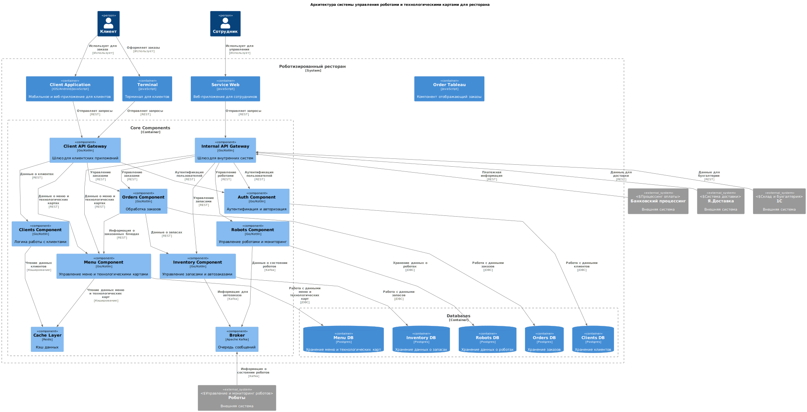

## Обоснование архитектуры

Архитектура системы построена с упором на масштабируемость, производительность и интеграцию с внешними системами, такими как роботы, платежные сервисы и инвентаризация.

1. **Модульная структура**:
   
    Система разделена на независимые модули (заказы, меню, инвентаризация), что позволяет легко обновлять и масштабировать систему, добавляя новые функции.

2. **API-шлюзы**:
   
      - **Client API Gateway** обрабатывает запросы от мобильных приложений, веб-сайтов и терминалов, обеспечивая безопасность и аутентификацию.
      - **Internal API Gateway** взаимодействует с внешними системами (оплата, доставка, роботы) и управляет внутренними процессами.

3. **Кэширование**:

    Используется Redis для ускорения доступа к часто запрашиваемым данным (например, меню), что снижает нагрузку на базу данных и ускоряет систему.

4. **Очереди сообщений (Kafka)**:

    Асинхронная обработка данных улучшает производительность и позволяет эффективно взаимодействовать между модулями и с роботами.

5. **Разделение баз данных**:

    Для каждого компонента (заказы, меню, клиенты, инвентарь) выделена своя база данных, что повышает производительность и безопасность.

6. **Интеграция с внешними системами**:

    Система взаимодействует с платёжными сервисами, службами доставки и системами управления роботами, что автоматизирует весь процесс обслуживания клиентов.

7. **Безопасность**:

    Аутентификация и передача данных защищены через HTTPS, обеспечивая безопасность пользователей и данных.

8.  **Масштабируемость и отказоустойчивость**:
   
    Использование облачных технологий и контейнеров позволяет легко расширять систему и поддерживать её работоспособность при высоких нагрузках.

## Диаграмма

## Описание компонентов

| № | Тип            | Наименование             | Технологии         | Описание                                                                                           |
|-------|----------------|--------------------------|--------------------|----------------------------------------------------------------------------------------------------|
| 1     | Мобильное/веб-приложение | Client Application       | iOS/Android/JavaScript | Приложение для клиентов, позволяющее просматривать меню, заказывать блюда, оплачивать заказы и отслеживать их статус. |
| 2     | Терминал       | Terminal                  | JavaScript         | Терминал самообслуживания, доступный в ресторане, для оформления заказов и оплаты.                  |
| 3     | Веб-приложение | Service Web               | JavaScript         | Интерфейс для сотрудников, обеспечивающий управление меню, заказами и настройками роботов.          |
| 4     | Компонент отображения | Order Tableau             | JavaScript         | Компонент для отображения статуса заказов на информационных экранах в ресторане.                   |
| 5     | Шлюз API       | Client API Gateway         | Java               | API шлюз для обработки запросов от клиентских приложений, терминалов и веб-приложений.              |
| 6     | Шлюз API       | Internal API Gateway       | Java               | Внутренний шлюз для взаимодействия между системными компонентами и внешними сервисами.              |
| 7     | Компонент безопасности | Auth Component            | Java               | Обеспечивает аутентификацию и авторизацию пользователей и сотрудников.                              |
| 8     | Бизнес-логика  | Orders Component           | Java               | Обрабатывает заказы: создание, изменение, оплата и управление статусами.                            |
| 9     | Бизнес-логика  | Menu Component             | Java               | Управляет меню ресторана, включая технологические карты блюд, их описание и цены.                   |
| 10    | Бизнес-логика  | Clients Component          | Java               | Управляет данными клиентов, включая их заказы, историю посещений и начисленные бонусы.              |
| 11    | Бизнес-логика  | Robots Component           | Java               | Управляет роботами, включая их задачи, мониторинг состояния и загрузку.                             |
| 12    | Бизнес-логика  | Inventory Component        | Java               | Управляет запасами продуктов, их учётом и автоматическими заказами на пополнение.                   |
| 13    | Очередь сообщений | Broker                   | Apache Kafka       | Система передачи сообщений для интеграции компонентов и обработки событий (например, состояние роботов). |
| 14    | Кэш данных     | Cache Layer               | Redis              | Обеспечивает кэширование часто используемых данных для быстрого доступа (например, меню и заказы).   |
| 15    | База данных    | Orders DB                 | Postgres           | Хранение данных о заказах, включая их статус, содержимое и историю изменений.                      |
| 16    | База данных    | Menu DB                   | Postgres           | Хранение данных о меню и технологических картах блюд.                                               |
| 17    | База данных    | Clients DB                | Postgres           | Хранение информации о клиентах, их профилях и начисленных бонусах.                                 |
| 18    | База данных    | Inventory DB              | Postgres           | Хранение информации о запасах продуктов, сроках хранения и уровнях пополнения.                      |
| 19    | База данных    | Robots DB                 | Postgres           | Хранение данных о роботах, их состоянии и задачах.                                                 |
| 20    | Внешняя система | Bank Processing            | Внешняя система    | Процессинг оплаты заказов через банковские системы.                                                 |
| 21    | Внешняя система | Я.Доставка                 | Внешняя система    | Система доставки заказов до клиента через партнёрские службы доставки.                              |
| 22    | Внешняя система | 1С Бухгалтерия             | Внешняя система    | Система управления складом и бухгалтерией, интегрированная с рестораном для учёта затрат.           |
| 23    | Внешняя система | Robots External System     | Внешняя система    | Внешняя система управления и мониторинга роботов, интегрированная с ресторанной системой.           |