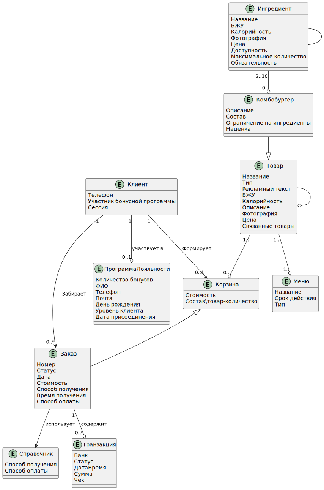
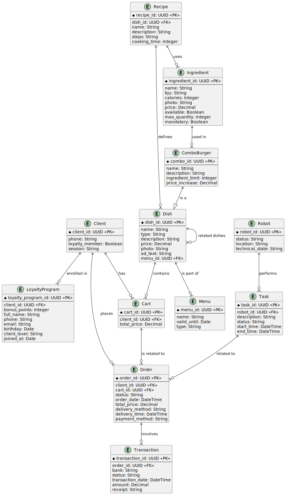

# Разработка базовой информационной модели

В рамках MVP проекта были выделены основные сущности с атрибутами и определены связи между ними.

Базовыми сущностями являются:

 - Клиент
 - Меню
 - Блюдо
 - Ингредиент
 - Робот
 - Технологическая карта

## Диаграмма классов

## Модель данных
