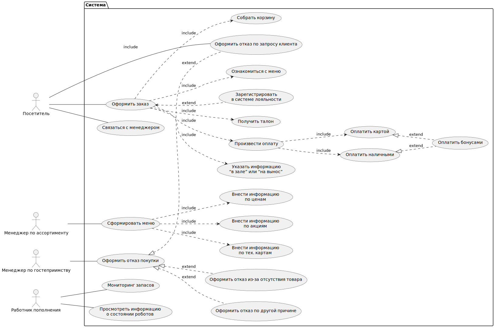

## Use Case
### Диаграмма

### UC-1: Оформление заказа

| Название                                            | UC-1: Оформление заказа                                                                                                                                                                                                                                                         |
| --------------------------------------------------- | ------------------------------------------------------------------------------------------------------------------------------------------------------------------------------------------------------------------------------------------------------------------------------ |
| Краткое описание                                    | Процесс оформления заказа покупателем, включая выбор блюд, добавление в корзину и оплату                                                                                                                                                                                       |
| Субъекты                                            | 1. Посетитель 2. Система                                                                                                                                                                                                                                                       |
| Предусловие                                         | Терминал работает, меню доступно, посетитель выбрал блюда                                                                                                                                                                                                                       |
| Основной сценарий                                   | 1. Посетитель активирует терминал. 2. Система отображает меню. 3. Посетитель выбирает блюда и добавляет их в корзину. 4. Посетитель подтверждает заказ. 5. Система предлагает варианты оплаты. 6. Посетитель выбирает способ оплаты и завершает транзакцию. 7. Система выдает номер заказа и передает информацию в производство. |
| Альтернативные сценарии                            | AF-1: Меню не отображается 1. Система выводит сообщение об ошибке. 2. Посетитель перезагружает систему. 3. Если ошибка сохраняется, посетителю предлагается помощь персонала. Конец сценария.  AF-2: Блюдо недоступно 1. Система сообщает об отсутствии ингредиентов. 2. Посетитель выбирает другое блюдо. Конец сценария.  AF-3: Проблемы с оплатой 1. Система сообщает о неудачной транзакции. 2. Посетитель выбирает другой способ оплаты. 3. Если ошибка повторяется, персонал уведомляется. |
| Наименования элементов пользовательского интерфейса | N1: "Выбрать блюдо" N2: "Подтвердить заказ" N3: "Выбрать способ оплаты" N4: "Завершить оплату"                                                                                                                   |

### UC-2: Регистрация в системе лояльности

| Название                                            | UC-2: Регистрация в системе лояльности                                                                                                                                                                                                                                        |
| --------------------------------------------------- | ---------------------------------------------------------------------------------------------------------------------------------------------------------------------------------------------------------------------------------------------------------------------------- |
| Краткое описание                                    | Процесс регистрации покупателя в системе лояльности для получения бонусов и скидок                                                                                                                                                                                             |
| Субъекты                                            | 1. Посетитель 2. Система                                                                                                                                                                                                                                                      |
| Предусловие                                         | Посетитель выбрал блюдо и приступает к оформлению заказа                                                                                                                                                                                                                      |
| Основной сценарий                                   | 1. Посетитель выбирает опцию регистрации в системе лояльности. 2. Система предлагает форму для ввода данных. 3. Посетитель вводит необходимые данные. 4. Система подтверждает регистрацию и возвращает пользователя к процессу оформления заказа.            |
| Альтернативные сценарии                            | AF-1: Ошибка ввода данных 1. Система выделяет ошибочные поля. 2. Посетитель исправляет данные. 3. Переход к п.4 основного сценария.                                                                                                                                     |
| Наименования элементов пользовательского интерфейса | N1: "Зарегистрироваться в системе лояльности" N2: "Ввести данные" N3: "Подтвердить регистрацию"                                                                                                                 |

### UC-3: Управление меню

| Название                                            | UC-3: Управление меню                                                                                                                                                                                                                                              |
| --------------------------------------------------- | ----------------------------------------------------------------------------------------------------------------------------------------------------------------------------------------------------------------------------------------------------------------- |
| Краткое описание                                    | Процесс добавления, редактирования и удаления позиций в меню, а также настройки акций и цен                                                                                                                                                                        |
| Субъекты                                            | 1. Менеджер по ассортименту 2. Система                                                                                                                                                                                                                        |
| Предусловие                                         | Менеджер авторизован в системе                                                                                                                                                                                                                                    |
| Основной сценарий                                   | 1. Менеджер выбирает опцию управления меню. 2. Система отображает текущие позиции меню. 3. Менеджер выбирает действие: добавление, редактирование или удаление. 4. Менеджер вводит необходимые данные и сохраняет изменения.                          |
| Альтернативные сценарии                            | AF-1: Некорректные данные 1. Система отображает ошибку. 2. Менеджер исправляет данные. 3. Переход к п.4 основного сценария.                                                                                                                                 |
| Наименования элементов пользовательского интерфейса | N1: "Добавить позицию" N2: "Редактировать позицию" N3: "Удалить позицию" N4: "Сохранить изменения"                                                                                                   |

### UC-4: Отмена заказа

| Название                                            | UC-4: Отмена заказа                                                                                                                                                                                                                                                       |
| --------------------------------------------------- | ------------------------------------------------------------------------------------------------------------------------------------------------------------------------------------------------------------------------------------------------------------------------- |
| Краткое описание                                    | Процесс отмены заказа по запросу клиента или из-за отсутствия товара                                                                                                                                                                                                      |
| Субъекты                                            | 1. Менеджер по гостеприимству 2. Посетитель 3. Система                                                                                                                                                                                                             |
| Предусловие                                         | Заказ был оформлен, но еще не выполнен                                                                                                                                                                                                                                  |
| Основной сценарий                                   | 1. Менеджер принимает запрос на отмену заказа. 2. Система проверяет статус заказа. 3. Если заказ не выполнен, система отменяет заказ и возвращает средства. 4. Система уведомляет посетителя о статусе отмены заказа.                                  |
| Альтернативные сценарии                            | AF-1: Отмена заказа из-за отсутствия товара 1. Система уведомляет менеджера о нехватке товара. 2. Менеджер отменяет заказ и уведомляет клиента. 3. Клиент получает уведомление о возврате средств.                                                     |
| Наименования элементов пользовательского интерфейса | N1: "Отменить заказ" N2: "Подтвердить отмену"                                                                                                                                                                                                                           |

### UC-5: Мониторинг состояния роботов

| Название                                            | UC-5: Мониторинг состояния роботов                                                                                                                                                                                                                      |
| --------------------------------------------------- | ------------------------------------------------------------------------------------------------------------------------------------------------------------------------------------------------------------------------------------------------------- |
| Краткое описание                                    | Процесс мониторинга состояния роботов для обеспечения их корректной работы и выполнения заказов                                                                                                                                                         |
| Субъекты                                            | 1. Работник по пополнению 2. Система                                                                                                                                                                                                                  |
| Предусловие                                         | Работник авторизован в системе                                                                                                                                                                                                                           |
| Основной сценарий                                   | 1. Работник выбирает опцию мониторинга роботов. 2. Система отображает текущее состояние всех роботов. 3. Работник просматривает информацию о состоянии роботов и при необходимости инициирует техническое обслуживание.                        |
| Альтернативные сценарии                            | AF-1: Робот не отображается 1. Система сообщает о проблеме с отображением данных. 2. Работник обращается к технической поддержке. 3. Проблема решается, и данные обновляются.                                                             |
| Наименования элементов пользовательского интерфейса | N1: "Просмотреть состояние роботов" N2: "Инициировать обслуживание"                                                                                                                                                                                   |